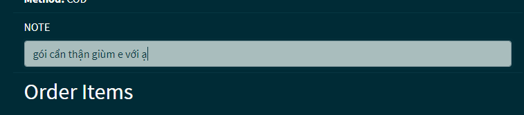

**Infor**:
1. Xây dựng website đặt thức ăn cho thú cưng
  - Thêm các trạng thái cho đơn hàng và update thời gian để khách hàng biết trạng thái đơn hàng của mình
  - Khi người dùng đặt hàng thành công thì đơn hàng ở trạng thái đang xử lý, khi shipper đến nhận hàng thì chuyển trạng thái thành đang chờ giao, shipper xác nhận đã giao chuyển trạng thái đã giao thành công vầ update thời gian giao
  - Người dùng kiểm tra trạng thái của đơn hàng bằng cách vào My orders để xem đơn hàng và chi tiết trạng thái của đơn hàng
---
3. Thêm một số chức năng
  - Đánh giá sản phẩm
  - Nhận xét sản phẩm
  - Nhận xét sản phẩm
  - thêm một input note khi đặt hàng, cho khách hàng yêu cầu gì đó về đơn hàng hay sản phẩm.Ví dụ như: nhắc nhở đóng gói cẩn thận giùm em,..
---
3. Đồ án
  - [Click here để xem đồ án](https://pet-callmeduc.herokuapp.com/)
  - Danh sách API [Click here API List](https://docs.google.com/spreadsheets/d/1G14JJEBfj7JL_42R1i6nRDpkCCIURwV7wiHNe1OTymc/edit?usp=sharing)
---
